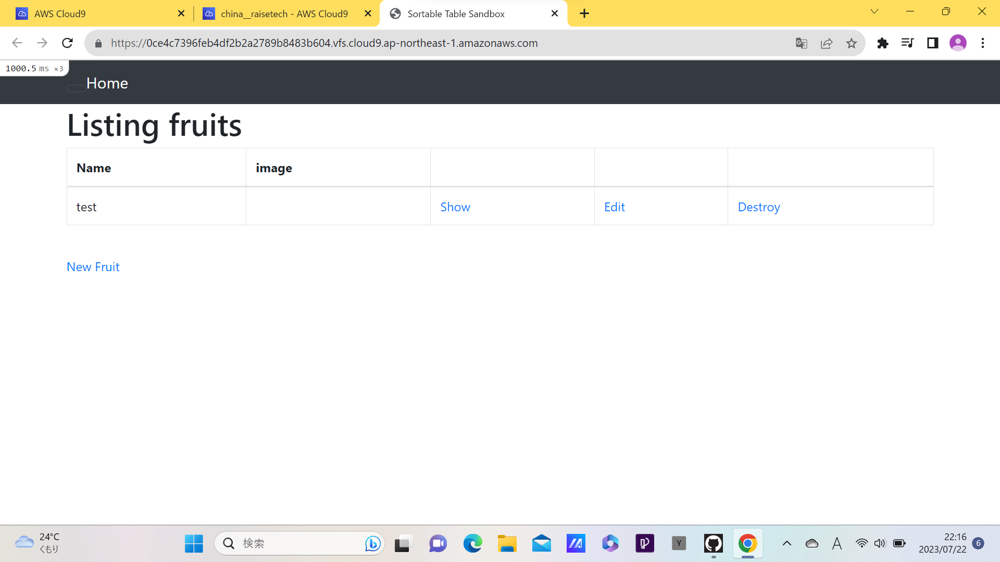
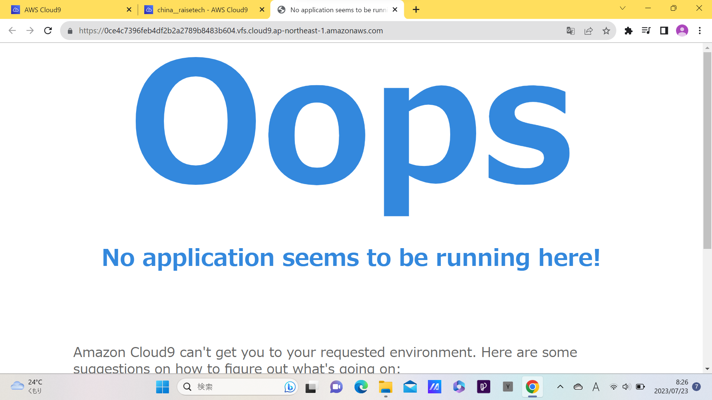
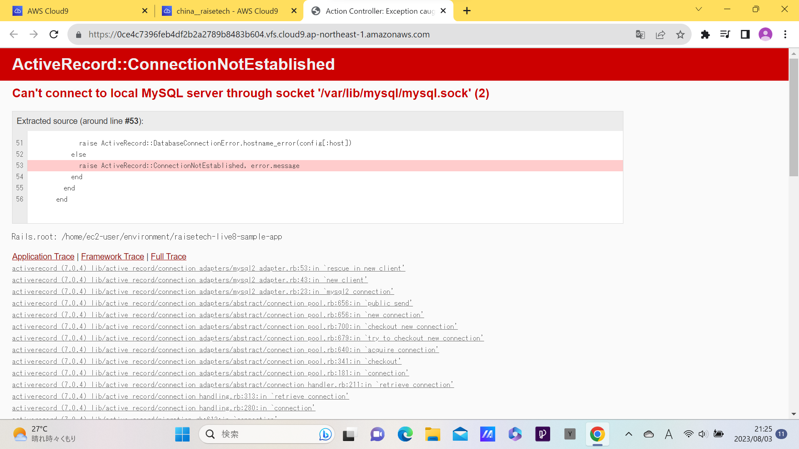

# 第3回課題

## APサーバーについて
ruby:pumaversion 5.6.5  
  

## DBサーバーについて
mysqlversion:8.0.34  

## Railsの構成管理ツール
Bundler

## 学んだこと
情報量が多く混乱したが、アプリケーションを作る際に必要なデータベースやツールなどを学んだ。  
サンプルアプリケーションを起動するまでの作業は難しかったがうまく起動できると嬉しかった。